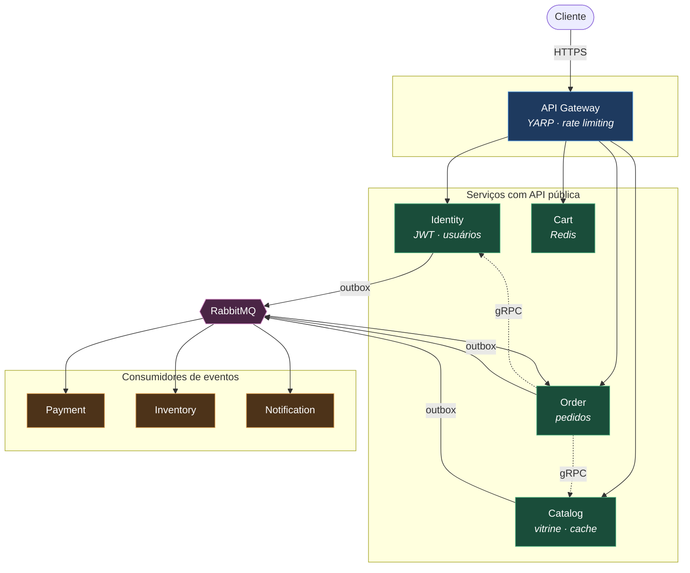
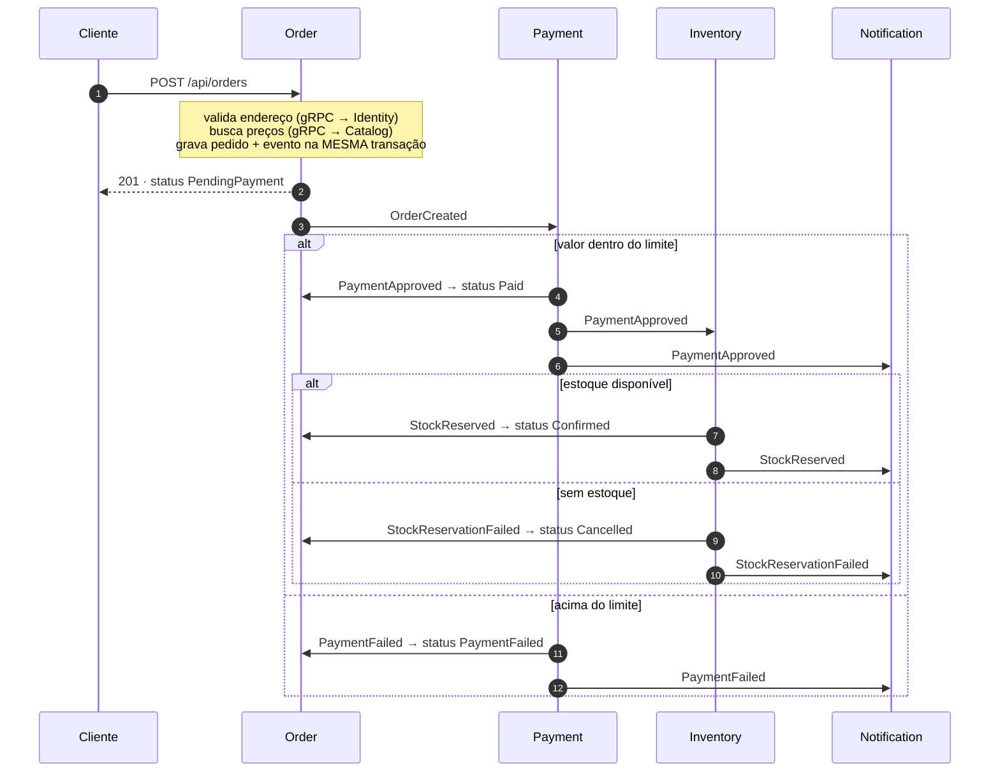

# MyMarketPlace

Sistema de marketplace distribuído em **.NET 10 / C# 13**, com Clean Architecture, mensageria, gRPC, cache, observabilidade e deploy em Kubernetes.

[](../../actions/workflows/ci.yml)

**Português (Brasil)** · [English](#english)

---

## Em 60 segundos

```bash
docker compose up -d --build      # sobe tudo (7 serviços + gateway + infra)
curl http://localhost:5000/catalog/api/products
```

O catálogo já vem populado. O passo a passo completo da demonstração está em [Roteiro de demonstração](#roteiro-de-demonstração).

---

## O que este projeto demonstra

| Tema | Onde está |
|---|---|
| **Clean Architecture** em 7 serviços | `Domain → Application → Infrastructure → API` |
| **DDD**: agregados, objetos de valor, modelo rico | `Order`, `Product`, `StockItem`, `User` |
| **CQRS** com MediatR e pipeline behaviors | `BuildingBlocks/Marketplace.Application` |
| **Saga por coreografia** com compensação | `Order.Application/Consumers` |
| **Outbox transacional** | `BuildingBlocks/.../OutboxPublisherBackgroundService` |
| **Consumidores idempotentes** | `RedisMessageDeduplicator` |
| **gRPC** entre serviços, com contrato compartilhado | `Order → Identity / Catalog` |
| **Cache-aside** com invalidação e proteção contra stampede | `CachedProductReadService` |
| **Resiliência**: retry, circuit breaker, kill switch | `ResiliencePolicies`, `MassTransitConfigurationExtensions` |
| **Concorrência otimista** | `StockItemConfiguration` (`xmin`) |
| **Segurança**: JWT, BCrypt, rotação de refresh token, IDOR | `Identity`, `ICurrentUser` |
| **Observabilidade**: traces, métricas e logs correlacionados | OpenTelemetry → Collector → Prometheus/Grafana |
| **Kubernetes**: probes, HPA, PDB, StatefulSet, secrets | `k8s/` |
| **97 testes** unitários e CI no GitHub Actions | `tests/`, `.github/workflows/ci.yml` |

Para o **porquê** de cada decisão (e as alternativas descartadas), leia **[ARCHITECTURE.md](ARCHITECTURE.md)**.

---

## Arquitetura



**Linha cheia** = HTTP/REST · **linha tracejada** = gRPC · **via RabbitMQ** = eventos assíncronos.

### O ciclo de vida de um pedido



O cliente recebe `201` imediatamente; o resto acontece de forma assíncrona. Consultar `GET /api/orders/{id}` algumas vezes mostra o status caminhando — é a forma mais direta de **ver** a coreografia funcionando.

---

## Os serviços

| Serviço | Responsabilidade | Persistência | Porta local |
|---|---|---|---|
| **ApiGateway** | Entrada única, roteamento, rate limiting | — | 5000 |
| **Identity** | Autenticação JWT, refresh token, endereços | PostgreSQL + outbox | 5100 · gRPC 5101 |
| **Catalog** | Vitrine de produtos | PostgreSQL + Redis + outbox | 5200 · gRPC 5201 |
| **Cart** | Carrinho de compras | Redis | 5300 |
| **Order** | Pedidos e máquina de estados | PostgreSQL + outbox | 5400 |
| **Payment** | Autorização (simulada) de pagamento | — (consumidor) | 5500 |
| **Inventory** | Dono da verdade do estoque | PostgreSQL | 5600 |
| **Notification** | Avisos ao cliente | — (consumidor) | 5700 |

---

## Como executar

### Opção 1 — Docker Compose (recomendado para demonstrar)

```bash
docker compose up -d --build
docker compose ps                     # todos devem ficar "healthy"
docker compose logs -f notification-api   # acompanha os eventos chegando
docker compose down -v                # derruba e apaga os volumes
```

| Recurso | Endereço | Credenciais |
|---|---|---|
| Gateway | http://localhost:5000 | — |
| Swagger (por serviço) | http://localhost:5100/swagger, `5200`, `5300`, `5400` | — |
| RabbitMQ | http://localhost:15672 | `guest` / `guest` |
| Grafana | http://localhost:3000 | `admin` / `admin` |
| Prometheus | http://localhost:9090 | — |

### Opção 2 — Kubernetes (k3s)

```bash
./start.sh          # build + import + apply + port-forward do gateway
./stop.sh           # remove os workloads (preserva os volumes)
./stop.sh --purgar  # remove também os dados
```

O `start.sh` cuida de tudo: gera as oito imagens, importa para o containerd do k3s (não há registry), aplica `k8s/platform.yaml` e `k8s/apps.yaml`, espera os pods e expõe o gateway em `http://localhost:5000`.

> Os HPAs precisam do `metrics-server` no cluster. O k3s já o inclui por padrão.

### Opção 3 — Localmente com `dotnet run`

```bash
# 1. apenas a infraestrutura em container
docker compose up -d postgres-identity postgres-catalog postgres-order \
                     postgres-inventory redis rabbitmq otel-collector prometheus grafana

# 2. cada serviço em um terminal
dotnet run --project Identity/Identity.API
dotnet run --project Catalog/Catalog.API
dotnet run --project Cart/Cart.API
dotnet run --project Order/Order.API
dotnet run --project Payment/Payment.API
dotnet run --project Inventory/Inventory.API
dotnet run --project Notification/Notification.API
dotnet run --project ApiGateway/ApiGateway.API
```

As portas são fixas (ver tabela acima) e já batem com a configuração do gateway e dos clientes gRPC.

---

## Roteiro de demonstração

Cole no terminal, passo a passo. Cada bloco mostra um conceito diferente.

```bash
GW=http://localhost:5000
```

**1. Vitrine pública** — não exige autenticação:

```bash
curl -s "$GW/catalog/api/products?pageSize=3" | jq
```

**2. Cadastro** — devolve o par de tokens e publica `UserCreatedEvent` via outbox:

```bash
REG=$(curl -s -X POST "$GW/identity/api/auth/register" -H 'Content-Type: application/json' \
  -d '{"name":"Bruno","email":"bruno@teste.com","password":"senha-forte-123"}')
TOKEN=$(echo "$REG" | jq -r .accessToken)
USERID=$(echo "$REG" | jq -r .userId)
```

Confirme no log: `docker compose logs notification-api | grep E-MAIL`.

**3. Endereço de entrega:**

```bash
ADDRID=$(curl -s -X POST "$GW/identity/api/users/$USERID/addresses" \
  -H "Authorization: Bearer $TOKEN" -H 'Content-Type: application/json' \
  -d '{"street":"Rua das Flores","number":"123","city":"Sao Paulo","state":"SP","zipCode":"01234-567","country":"Brasil"}' | jq -r .id)
```

**4. Carrinho** — note que a rota é `/me`, não `/{userId}`:

```bash
PRODID=$(curl -s "$GW/catalog/api/products?pageSize=1" | jq -r '.items[0].id')

curl -s -X PUT "$GW/cart/api/carts/me" -H "Authorization: Bearer $TOKEN" \
  -H 'Content-Type: application/json' \
  -d "{\"items\":[{\"productId\":\"$PRODID\",\"name\":\"Item\",\"unitPrice\":279.90,\"quantity\":2}]}" | jq
```

**5. Pedido** — e o saga em ação:

```bash
ORDERID=$(curl -s -X POST "$GW/order/api/orders" -H "Authorization: Bearer $TOKEN" \
  -H 'Content-Type: application/json' \
  -d "{\"addressId\":\"$ADDRID\",\"items\":[{\"productId\":\"$PRODID\",\"quantity\":2}]}" | jq -r .orderId)

# Rode algumas vezes: PendingPayment -> Paid -> Confirmed
watch -n1 "curl -s $GW/order/api/orders/$ORDERID -H 'Authorization: Bearer $TOKEN' | jq -r .status"
```

**6. Caminho de compensação** — pedido acima do limite simulado de R$ 10.000:

```bash
CARO=$(curl -s "$GW/catalog/api/products?search=Cadeira" | jq -r '.items[0].id')

curl -s -X POST "$GW/order/api/orders" -H "Authorization: Bearer $TOKEN" \
  -H 'Content-Type: application/json' \
  -d "{\"addressId\":\"$ADDRID\",\"items\":[{\"productId\":\"$CARO\",\"quantity\":10}]}" | jq
# poucos segundos depois: status PaymentFailed, com o motivo em statusReason
```

**7. Segurança** — as correções de IDOR:

```bash
# 403: token válido, mas o perfil é de outra pessoa
curl -s -o /dev/null -w "%{http_code}\n" \
  "$GW/identity/api/users/00000000-0000-0000-0000-000000000001" -H "Authorization: Bearer $TOKEN"

# 401: sem token
curl -s -o /dev/null -w "%{http_code}\n" "$GW/identity/api/users/me"
```

**8. Erros padronizados** (RFC 9457 · `application/problem+json`):

```bash
curl -s -X POST "$GW/identity/api/auth/register" -H 'Content-Type: application/json' \
  -d '{"name":"","email":"nao-e-email","password":"123"}' | jq
```

**9. Observabilidade** — o `traceId` da resposta de erro é o mesmo do trace distribuído:

```bash
docker compose logs otel-collector | grep -A5 "Name.*POST /api/orders" | head -20
```

Também existe uma coleção pronta em [`postman/`](postman/).

---

## Testes

```bash
dotnet test                                    # 97 testes, ~3s
dotnet test --project tests/Order.UnitTests    # um projeto específico
```

| Projeto | Foco |
|---|---|
| `Marketplace.SharedKernel.Tests` | `ValueObject`, `Result`, eventos de domínio |
| `Identity.UnitTests` | normalização de e-mail, hash de senha, rotação de refresh token |
| `Catalog.UnitTests` | invariantes de produto, validadores |
| `Order.UnitTests` | **máquina de estados** (duplicatas, fora de ordem), criação de pedido |
| `Inventory.UnitTests` | reserva tudo-ou-nada, idempotência do estoque |
| `Cart.UnitTests` | consolidação de itens, limites |

Os testes de `Order.UnitTests` são os mais relevantes: cobrem duplicidade de mensagem e chegada fora de ordem — os cenários que só aparecem em produção.

---

## Correções aplicadas nesta revisão

Bugs reais encontrados durante a revisão e a execução do fluxo ponta a ponta:

| # | Problema | Impacto |
|---|---|---|
| 1 | **Filas compartilhadas entre serviços** — `PaymentApprovedConsumer` existia em Order, Inventory e Notification, e os três se ligavam à fila `payment-approved` | RabbitMQ entregava cada mensagem a apenas **um** deles: de cada 3 pagamentos, ~1 atualizava o pedido, ~1 reservava estoque, ~1 notificava. Sem nenhum erro em log |
| 2 | **Chave de deduplicação colidindo** — a chave usava o nome curto da classe | Inventory e Notification competiam pela mesma marca; a notificação de pagamento nunca era enviada |
| 3 | **Reserva de estoque errada** — baixava 1 unidade de um produto arbitrário | Estoque divergia da realidade em toda venda. Raiz: `PaymentApprovedEvent` não carregava os itens |
| 4 | **Normalização de e-mail inconsistente** — checava duplicidade com o valor cru, gravava normalizado | `Ana@X.com` após `ana@x.com` estourava violação de índice único → HTTP 500 |
| 5 | **IDOR em 3 endpoints** — perfil, endereços e carrinho aceitavam `userId` da URL/corpo | Qualquer usuário lia e alterava dados de terceiros trocando um GUID |
| 6 | **gRPC na mesma porta do REST** sem TLS | `HTTP_1_1_REQUIRED`: nenhum pedido podia ser criado |
| 7 | **`docker compose` não funcionava** — containers sem variáveis de ambiente usavam `localhost` do appsettings | Sete serviços subiam sem conectar em nada |
| 8 | **Portas locais divergentes** — `launchSettings` sorteava portas que não batiam com gateway e gRPC | Execução com `dotnet run` quebrada |
| 9 | **`InvalidOperationException → 400`** no middleware de erros | Bugs de infraestrutura mascarados como erro do cliente; nenhum log |
| 10 | **Cache sem invalidação** | Alteração de produto só aparecia após o TTL de 10 min |
| 11 | **Sem status de pedido após a criação** | O pedido ficava em `PendingPayment` para sempre — o saga não tinha efeito visível |
| 12 | **HPA sem `resources.requests`** | Autoscaler não funcionava (não há base para calcular utilização) |
| 13 | **Refresh token em texto puro** no banco | Vazamento do banco = sessões sequestráveis |
| 14 | **Pacotes com CVE conhecido** (`Microsoft.OpenApi` 2.3.0, OpenTelemetry 1.12.0) | Vulnerabilidades altas e moderadas |

Além disso: projetos vazios removidos, `ValidationBehavior` duplicado extraído para os building blocks, health checks e probes adicionados, e o código inteiro documentado.

---

## Estrutura

```
MyMarketPlace/
├── BuildingBlocks/
│   ├── Marketplace.SharedKernel/    # Entity, ValueObject, Result, exceções — sem dependências
│   ├── Marketplace.Contracts/       # eventos de integração + DTOs gRPC
│   ├── Marketplace.Application/     # pipeline MediatR compartilhado
│   └── Marketplace.Infrastructure/  # outbox, idempotência, JWT, health, telemetria
├── ApiGateway/                      # YARP
├── Identity/ Catalog/ Cart/ Order/  # serviços com API pública
├── Payment/ Inventory/ Notification/# consumidores de eventos
├── tests/                           # 6 projetos, 97 testes
├── k8s/                             # platform.yaml + apps.yaml
├── observability/                   # OTel Collector, Prometheus, Grafana
└── postman/                         # coleção de testes manuais
```

Cada serviço segue quatro camadas — `Domain`, `Application`, `Infrastructure`, `API` — **exceto quando não há o que colocar nelas**: Payment e Notification não têm `Domain`, e o gateway é um projeto único. Camada vazia criada por simetria é ruído, não arquitetura.

---

## Dicas de execução

**Ver o SQL gerado pelo EF Core:**

```bash
# em appsettings.Development.json
"Microsoft.EntityFrameworkCore.Database.Command": "Information"
```

**Inspecionar o outbox:**

```bash
docker compose exec postgres-order psql -U postgres -d orderdb \
  -c 'SELECT "Type","OccurredOnUtc","ProcessedOnUtc","AttemptCount" FROM outbox_messages;'
```

**Ver as filas e quem está consumindo:**

```bash
docker compose exec rabbitmq rabbitmqctl list_queues name messages consumers
```

**Provocar o caminho de falha do estoque:** baixe o `ApprovalLimit` do Payment ou peça mais unidades do que existem.

---
---

<a name="english"></a>

# English

Distributed marketplace in **.NET 10 / C# 13** — Clean Architecture, messaging, gRPC, caching, observability and Kubernetes deployment.

## Quick start

```bash
docker compose up -d --build
curl http://localhost:5000/catalog/api/products
```

The catalog is seeded on first boot. See [Demo script](#roteiro-de-demonstração) for the full walkthrough (commands are language-neutral).

## What it demonstrates

- **Clean Architecture** across 7 services (`Domain → Application → Infrastructure → API`)
- **DDD**: aggregates, value objects, rich domain models with enforced invariants
- **CQRS** via MediatR with shared logging/validation pipeline behaviors
- **Choreography saga** with a compensating path (paid order, no stock → cancelled)
- **Transactional outbox** — business change and integration event committed atomically
- **Idempotent consumers** — Redis `SET NX` deduplication, at-least-once delivery handled
- **gRPC** for synchronous inter-service calls, sharing a single `.proto` contract
- **Cache-aside** with explicit invalidation, TTL jitter and graceful degradation
- **Resilience**: Polly retry + circuit breaker; MassTransit retry, circuit breaker, kill switch
- **Optimistic concurrency** on stock via PostgreSQL `xmin`
- **Security**: JWT with rotation, BCrypt, hashed refresh tokens, IDOR fixes, timing-safe login
- **Observability**: OpenTelemetry traces, metrics and logs correlated by `traceId`
- **Kubernetes**: liveness/readiness/startup probes, HPA, PDB, StatefulSets, secrets
- **97 unit tests** and a GitHub Actions pipeline (build, test, vulnerability audit, image build)

Design rationale — including alternatives that were rejected and why — lives in **[ARCHITECTURE.md](ARCHITECTURE.md)** (Portuguese).

## Services

| Service | Responsibility | Storage | Local port |
|---|---|---|---|
| ApiGateway | Single entry point, routing, rate limiting | — | 5000 |
| Identity | JWT auth, refresh tokens, addresses | PostgreSQL + outbox | 5100 · gRPC 5101 |
| Catalog | Product catalog | PostgreSQL + Redis + outbox | 5200 · gRPC 5201 |
| Cart | Shopping cart | Redis | 5300 |
| Order | Orders and state machine | PostgreSQL + outbox | 5400 |
| Payment | Simulated payment authorization | — (consumer) | 5500 |
| Inventory | Source of truth for stock | PostgreSQL | 5600 |
| Notification | Customer notifications | — (consumer) | 5700 |

## Running

```bash
docker compose up -d --build     # everything in containers
./start.sh                       # k3s: build, import, apply, port-forward
dotnet test                      # 97 tests
```

Endpoints: gateway `:5000`, Swagger per service (`:5100/swagger`, …), RabbitMQ `:15672` (guest/guest), Grafana `:3000` (admin/admin), Prometheus `:9090`.

## Notable fixes in this revision

Fourteen real defects were found and fixed — including three that made the system silently lose work: services competing on the same RabbitMQ queue, colliding idempotency keys, and stock reservation decrementing an arbitrary product. Full list in the [Portuguese section](#correções-aplicadas-nesta-revisão).
